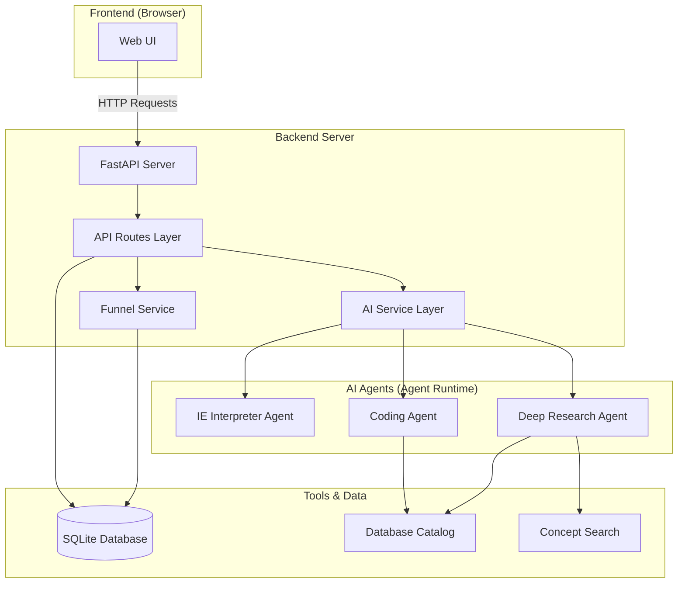
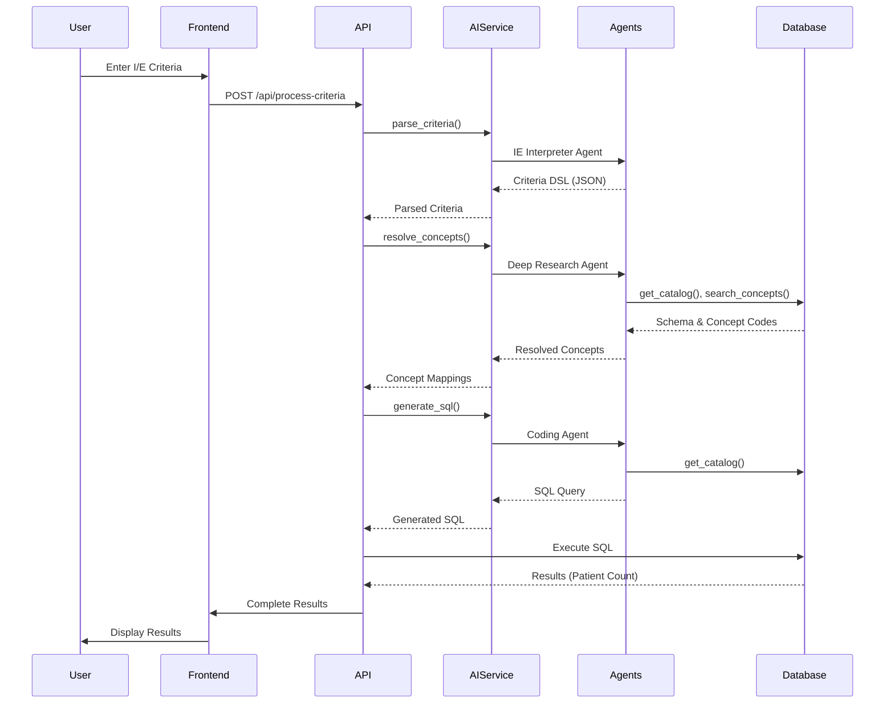
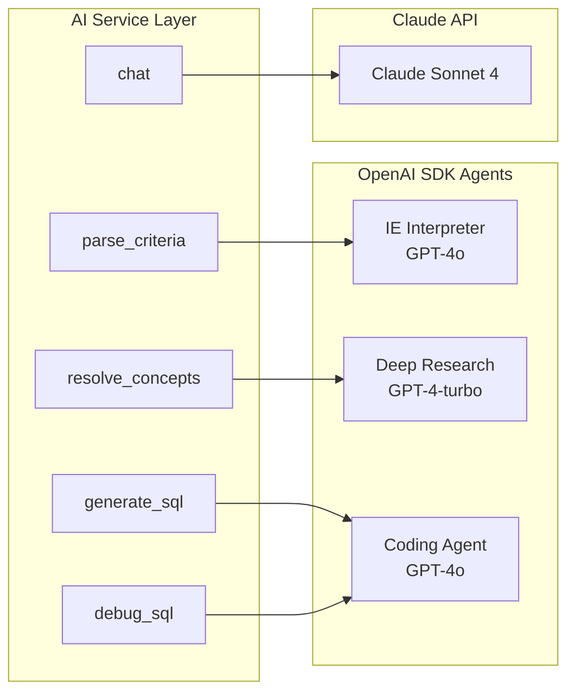

# RWD IE Optimizer - System Architecture

## Table of Contents
- [Overview](#overview)
- [Architecture Diagrams](#architecture-diagrams)
- [Directory Structure](#directory-structure)
- [Core Components](#core-components)
- [Data Flow](#data-flow)
- [AI Service Layer](#ai-service-layer)
- [API Endpoints](#api-endpoints)
- [Database Schema](#database-schema)

---

## Overview

The RWD IE Optimizer converts clinical trial inclusion/exclusion criteria text into executable SQL queries over Real-World Data (RWD). It uses a multi-agent AI architecture with clean separation of concerns.

**Key Principles:**
- Clean architecture with separated layers
- AI services abstracted from API routes
- No hardcoded clinical knowledge
- All mappings come from tools and catalog queries

---

## Architecture Diagrams

### High-Level System Architecture



### Request Flow Diagram



### AI Service Layer Architecture



---

## Directory Structure

```
rwd_ie_optimizer/
├── api_server_refactored.py      # Main FastAPI entry point (CLEAN)
├── api_server.py                  # Old server (to be deprecated)
│
├── src/
│   ├── api/                       # API Layer
│   │   ├── __init__.py
│   │   └── routes.py             # All API endpoints
│   │
│   ├── services/                  # Business Logic Layer
│   │   ├── __init__.py
│   │   ├── ai_service.py         # AI/LLM operations
│   │   └── funnel_service.py     # Funnel calculations
│   │
│   ├── agents/                    # AI Agents
│   │   ├── __init__.py
│   │   └── agents.py             # Agent definitions
│   │
│   ├── tools/                     # Data Tools
│   │   ├── __init__.py
│   │   ├── catalog.py            # Database schema access
│   │   ├── concept_search.py     # Medical concept search
│   │   ├── unit_resolver.py      # Unit conversions
│   │   ├── sql_executor.py       # SQL execution
│   │   └── artifact_store.py     # Result persistence
│   │
│   └── config/                    # Configuration
│       ├── settings.py           # App settings
│       └── prompts/              # AI Agent Prompts
│           ├── ie_interpreter.txt
│           ├── deep_research.txt
│           ├── coding_agent.txt
│           ├── sql_runner.txt
│           ├── receiver.txt
│           └── orchestrator.txt
│
├── static/                        # Frontend
│   └── index.html                # Single-page UI
│
├── data/                          # Database
│   └── rwd_claims.db             # SQLite database
│
└── tests/                         # Unit tests
```

---

## Core Components

### 1. API Layer (`src/api/`)

**Purpose:** Clean, organized API endpoint definitions

**File:** `routes.py`
- Main workflow endpoint (`/api/process-criteria`)
- SQL execution endpoints
- AI assistance endpoints
- Funnel analysis endpoints

**Responsibilities:**
- Request validation (Pydantic models)
- Service orchestration
- Response formatting
- Error handling

### 2. Service Layer (`src/services/`)

**Purpose:** Business logic and AI operations

#### AIService (`ai_service.py`)
Centralized service for all AI/LLM interactions:
- `parse_criteria()` - Parse I/E text → Criteria DSL
- `resolve_concepts()` - Medical concepts → Database codes
- `generate_sql()` - Criteria DSL → SQL queries
- `debug_sql()` - SQL error analysis
- `chat()` - Interactive AI assistance

#### FunnelService (`funnel_service.py`)
Patient funnel calculations:
- `calculate_funnel()` - Standard funnel steps
- `calculate_whatif()` - "What If" scenario analysis

### 3. Agents Layer (`src/agents/`)

**Purpose:** AI agent definitions using the internal agent runtime

**Agents:**
1. **IE Interpreter** - Parses raw I/E text into JSON
2. **Deep Research** - Resolves medical concepts to codes
3. **Coding Agent** - Generates SQL from criteria
4. **SQL Runner** - Executes and validates SQL
5. **Receiver** - Generates final summary
6. **Orchestrator** - Coordinates all agents

### 4. Tools Layer (`src/tools/`)

**Purpose:** Data access and utility functions

- `catalog.py` - Database schema metadata
- `concept_search.py` - Medical concept resolution
- `unit_resolver.py` - Unit conversions
- `sql_executor.py` - Safe SQL execution
- `artifact_store.py` - Result persistence

### 5. Configuration (`src/config/`)

**Prompts Directory:**
- Each agent has a dedicated prompt file
- Easy to modify and version control
- Clear separation of logic and instructions

---

## Data Flow

### Stage 1: Criteria Parsing

```
User Input (Text)
    ↓
IE Interpreter Agent
    ↓
Criteria DSL (JSON)
```

**Example Input:**
```
INCLUSION CRITERIA:
1. Adults aged 18 to 75 years
2. Type 2 Diabetes Mellitus diagnosis
```

**Example Output:**
```json
{
  "inclusion": [
    {
      "id": "I01",
      "description": "Adults aged 18 to 75 years",
      "domain": "demographic",
      "concept": "age",
      "value_constraint": {"operator": "between", "value": [18, 75]}
    },
    {
      "id": "I02",
      "description": "Type 2 Diabetes Mellitus diagnosis",
      "domain": "diagnosis",
      "concept": "Type 2 Diabetes"
    }
  ]
}
```

### Stage 2: Concept Resolution

```
Criteria DSL
    ↓
Deep Research Agent
    ├─→ get_catalog()
    ├─→ search_concepts()
    └─→ resolve_units()
    ↓
Resolved Concepts (Code Mappings)
```

**Example:**
```
"Type 2 Diabetes" → ICD10CM: E11.%
"Metformin" → RxNorm: [concept IDs]
```

### Stage 3: SQL Generation

```
Criteria DSL + Resolved Concepts
    ↓
Coding Agent
    ├─→ get_catalog()
    └─→ Build CTEs
    ↓
SQL Query (WITH CTEs)
```

### Stage 4: Execution & Funnel

```
SQL Query
    ↓
SQL Executor
    ↓
Results (Patient Count)
    ↓
Funnel Service
    ↓
Funnel Steps (Attrition Analysis)
```

---

## AI Service Layer

### Architecture Pattern

```
API Routes → AI Service → Agent Runtime → Tools → Database
```

**Benefits:**
1. **Separation of Concerns** - API doesn't know about agents
2. **Testability** - Services can be mocked
3. **Maintainability** - Changes isolated to service layer
4. **Reusability** - Services used by multiple endpoints

### AI Service Methods

#### 1. `parse_criteria(criteria_text: str) -> Dict`
**Input:** Raw I/E criteria text
**Output:** Criteria DSL JSON
**Agent:** IE Interpreter (GPT-4o)
**Prompt Location:** `src/config/prompts/ie_interpreter.txt`

#### 2. `resolve_concepts(criteria_dsl: Dict) -> str`
**Input:** Criteria DSL
**Output:** Resolved concept mappings
**Agent:** Deep Research (GPT-4-turbo)
**Tools Used:** get_catalog(), search_concepts(), resolve_units()
**Prompt Location:** `src/config/prompts/deep_research.txt`

#### 3. `generate_sql(criteria_dsl: Dict) -> str`
**Input:** Criteria DSL + Code mappings
**Output:** SQL query
**Agent:** Coding Agent (GPT-4o)
**Tools Used:** get_catalog()
**Prompt Location:** `src/config/prompts/coding_agent.txt`

#### 4. `debug_sql(sql: str, error: str, tables: List) -> Dict`
**Input:** Failed SQL + error message
**Output:** Analysis + corrected SQL
**Agent:** Coding Agent (GPT-4o)

#### 5. `chat(message: str, sql: str, tables: List, history: List) -> Dict`
**Input:** User message + SQL context
**Output:** AI response + corrected SQL
**Model:** Claude Sonnet 4
**API:** Anthropic Messages API

---

## API Endpoints

### Main Workflow

#### `POST /api/process-criteria`
**Purpose:** Complete end-to-end processing
**Input:** `{"criteria_text": "..."}`
**Output:** All stages + results
**Flow:**
1. Parse criteria (Stage 1)
2. Resolve concepts (Stage 2)
3. Generate SQL (Stage 3)
4. Execute SQL (Stage 4)
5. Calculate funnel (Stage 5)

### SQL Operations

#### `POST /api/execute-sql`
**Purpose:** Execute custom SQL query
**Input:** `{"sql": "SELECT ..."}`
**Output:** Query results

#### `GET /api/database-info`
**Purpose:** Get database statistics
**Output:** Patient count, claims count, table list

### AI Assistance

#### `POST /api/debug-sql`
**Purpose:** Get AI help debugging SQL errors
**Input:** `{"sql": "...", "error": "..."}`
**Output:** Error analysis + corrected SQL

#### `POST /api/ai-chat`
**Purpose:** Interactive AI chat for SQL help
**Input:** `{"message": "...", "sql": "...", "chat_history": [...]}`
**Output:** AI response + optional corrected SQL

### Funnel Analysis

#### `POST /api/funnel-whatif`
**Purpose:** Calculate what-if scenarios
**Input:** `{"enabled_inclusion": [...], "enabled_exclusion": [...], "criteria_dsl": {...}}`
**Output:** Funnel steps with counts

---

## Database Schema

### Tables

#### `patients`
```sql
patient_id INTEGER PRIMARY KEY
age INTEGER
gender TEXT
```

#### `claims`
```sql
claim_id INTEGER PRIMARY KEY
patient_id INTEGER
primary_diagnosis_code TEXT
secondary_diagnosis_code TEXT
tertiary_diagnosis_code TEXT
drug_name TEXT
procedure_code TEXT
```

### Common Query Patterns

**Age Filter:**
```sql
SELECT * FROM patients WHERE age BETWEEN 18 AND 75
```

**Diagnosis Filter (ICD-10):**
```sql
SELECT DISTINCT patient_id FROM claims
WHERE primary_diagnosis_code LIKE 'E11%'
   OR secondary_diagnosis_code LIKE 'E11%'
   OR tertiary_diagnosis_code LIKE 'E11%'
```

**Drug Filter:**
```sql
SELECT DISTINCT patient_id FROM claims
WHERE drug_name LIKE '%Metformin%'
```

---

## Prompt Management

### Location
All AI prompts are stored in: `src/config/prompts/`

### Prompt Files
- `ie_interpreter.txt` - Criteria parsing instructions
- `deep_research.txt` - Concept resolution instructions
- `coding_agent.txt` - SQL generation instructions
- `sql_runner.txt` - SQL execution instructions
- `receiver.txt` - Summary generation instructions
- `orchestrator.txt` - Workflow coordination instructions

### Loading Prompts
```python
from pathlib import Path

def load_prompt(agent_name: str) -> str:
    prompts_dir = Path(__file__).parent.parent / "config" / "prompts"
    prompt_file = prompts_dir / f"{agent_name}.txt"
    return prompt_file.read_text()
```

---

## Key Design Decisions

### 1. Service Layer Abstraction
**Why:** Separates AI logic from API routing
**Benefit:** Easier testing, better maintainability

### 2. Singleton Services
**Why:** Reuse AI clients across requests
**Implementation:** `get_ai_service()`, `get_funnel_service()`

### 3. Pydantic Models
**Why:** Request/response validation
**Benefit:** Type safety, automatic API docs

### 4. Multi-Agent Architecture
**Why:** Specialized agents for specific tasks
**Benefit:** Better performance, clearer responsibilities

### 5. No Hardcoded Clinical Logic
**Why:** Clinical knowledge changes frequently
**Solution:** All mappings from tools/catalog

---

## Migration Guide

### From Old to New Architecture

**Old:** `api_server.py` (monolithic)
**New:** `api_server_refactored.py` (clean)

**Steps:**
1. Import refactored modules
2. Test all endpoints
3. Verify AI responses
4. Switch to refactored server
5. Deprecate old server

**Running Refactored Server:**
```bash
python api_server_refactored.py
```

---

## Testing

### Unit Tests
```
tests/
├── test_agents/
├── test_tools/
└── test_services/  (new)
```

### Integration Tests
- Test complete workflow
- Verify AI responses
- Check database queries

---

## Future Enhancements

1. **Caching Layer** - Cache AI responses
2. **Async Processing** - Background job queue
3. **Monitoring** - Metrics and logging
4. **Multi-tenancy** - Support multiple databases
5. **API Versioning** - v1, v2 endpoints

---

## Troubleshooting

### Common Issues

**Issue:** AI service not initializing
**Solution:** Check ANTHROPIC_API_KEY in .env

**Issue:** Database not found
**Solution:** Verify data/rwd_claims.db exists

**Issue:** Import errors
**Solution:** Ensure src/ is in PYTHONPATH

---

## Version History

| Version | Date | Changes |
|---------|------|---------|
| 2.0.0 | 2025-01 | Refactored architecture with service layer |
| 1.0.0 | 2025-01 | Initial implementation |

---

## Contact & Support

**Project:** RWD IE Optimizer
**Architecture Version:** 2.0.0
**Last Updated:** January 2025
