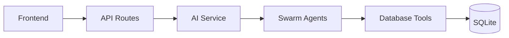

# RWD IE Optimizer - Refactored Architecture

> **Clean, organized, production-ready codebase with clear separation of concerns**

## 🚀 Quick Start

### 1. Install Dependencies
```bash
pip install -r requirements.txt
```

### 2. Configure Environment
```bash
cp .env.example .env
# Edit .env and add your API keys:
# - ANTHROPIC_API_KEY=your_key_here
# - OPENAI_API_KEY=your_key_here
```

### 3. Run the Server
```bash
# Use the NEW refactored server
python api_server_refactored.py
```

### 4. Open Browser
```
http://localhost:8000
```

---

## 📁 Clean Architecture

```
src/
├── api/              # API Routes Layer
│   └── routes.py     # All API endpoints
│
├── services/         # Business Logic Layer
│   ├── ai_service.py    # AI/LLM operations
│   └── funnel_service.py # Funnel calculations
│
├── agents/           # AI Agents (Swarm)
│   └── agents.py     # Agent definitions
│
├── tools/            # Data Access Layer
│   ├── catalog.py
│   ├── sql_executor.py
│   └── ...
│
└── config/
    └── prompts/      # AI Agent Prompts
        ├── ie_interpreter.txt
        ├── deep_research.txt
        └── coding_agent.txt
```

---

## 🎯 Key Features

### ✅ Clean Separation of Concerns
- **API Layer** - HTTP endpoints only
- **Service Layer** - Business logic & AI operations
- **Tools Layer** - Database & utility functions

### ✅ Centralized AI Service
All AI operations in one place:
```python
from src.services import get_ai_service

ai = get_ai_service()
criteria_dsl = ai.parse_criteria(text)
concepts = ai.resolve_concepts(criteria_dsl)
sql = ai.generate_sql(criteria_dsl)
```

### ✅ Organized Prompts
All AI prompts in dedicated files:
```
src/config/prompts/
├── ie_interpreter.txt    # Parsing instructions
├── deep_research.txt     # Concept resolution
└── coding_agent.txt      # SQL generation
```

### ✅ Comprehensive Documentation
- `ARCHITECTURE.md` - System architecture with diagrams
- `README_REFACTORED.md` - This file
- Inline code documentation

---

## 🔄 Request Flow



**1. User enters criteria** → Frontend
**2. API receives request** → Routes layer
**3. AI processes** → AI Service → Swarm Agents
**4. SQL executes** → Database
**5. Results return** → Frontend

---

## 📊 API Endpoints

### Main Workflow
```http
POST /api/process-criteria
{
  "criteria_text": "INCLUSION: Adults 18-75..."
}
```

### SQL Operations
```http
POST /api/execute-sql
GET  /api/database-info
```

### AI Assistance
```http
POST /api/debug-sql
POST /api/ai-chat
```

### Funnel Analysis
```http
POST /api/funnel-whatif
```

---

## 🧪 Testing

### Test Refactored Server
```bash
# 1. Start server
python api_server_refactored.py

# 2. Test health endpoint
curl http://localhost:8000/health

# 3. Test main workflow
curl -X POST http://localhost:8000/api/process-criteria \
  -H "Content-Type: application/json" \
  -d '{"criteria_text": "INCLUSION: Adults 18-75 years"}'
```

---

## 🔑 Environment Variables

Required in `.env`:
```bash
# AI API Keys
ANTHROPIC_API_KEY=sk-ant-...
OPENAI_API_KEY=sk-proj-...

# Database
DATABASE_PATH=data/rwd_claims.db

# Logging
LOG_LEVEL=INFO
```

---

## 🆕 What's New in Refactored Version

### Before (Monolithic)
```python
# api_server.py - Everything in one file
@app.post("/api/process-criteria")
async def process_criteria(input):
    # 600+ lines of mixed logic
    # AI calls
    # SQL generation
    # Funnel calculation
    # All in one function
```

### After (Clean Architecture)
```python
# api_server_refactored.py - Clean entry point
from src.api.routes import router
app.include_router(router)

# src/api/routes.py - Just routing
@router.post("/api/process-criteria")
async def process_criteria(input):
    ai_service = get_ai_service()
    funnel_service = get_funnel_service()

    criteria = ai_service.parse_criteria(input.text)
    concepts = ai_service.resolve_concepts(criteria)
    sql = ai_service.generate_sql(criteria)
    funnel = funnel_service.calculate_funnel(criteria)
```

---

## 📖 Documentation

- **[ARCHITECTURE.md](./ARCHITECTURE.md)** - Comprehensive system documentation
  - Architecture diagrams
  - Data flow
  - Component descriptions
  - Prompt management

- **[claude.md](./claude.md)** - Original project requirements

- **Code Comments** - Inline documentation in all modules

---

## 🔧 Development

### Adding New Endpoints
```python
# src/api/routes.py
@router.post("/api/new-endpoint")
async def new_endpoint():
    ai = get_ai_service()
    result = ai.new_method()
    return result
```

### Adding New AI Methods
```python
# src/services/ai_service.py
class AIService:
    def new_method(self, input: str) -> str:
        response = self.swarm_client.run(
            agent=some_agent,
            messages=[{"role": "user", "content": input}]
        )
        return response.messages[-1]["content"]
```

### Modifying Prompts
```
# Just edit the text file!
src/config/prompts/ie_interpreter.txt
```

---

## 🐛 Troubleshooting

### Import Errors
```bash
# Ensure src/ is in PYTHONPATH
export PYTHONPATH="${PYTHONPATH}:$(pwd)"
```

### API Key Issues
```bash
# Check .env file
cat .env | grep API_KEY

# Verify environment variable
python -c "import os; from dotenv import load_dotenv; load_dotenv(); print(os.getenv('ANTHROPIC_API_KEY'))"
```

### Database Issues
```bash
# Verify database exists
ls -la data/rwd_claims.db

# Check tables
sqlite3 data/rwd_claims.db ".tables"
```

---

## 📈 Performance

### Singleton Services
- AI Service initialized once
- Reused across all requests
- Lower memory footprint

### Async Operations
- FastAPI async endpoints
- Concurrent request handling

---

## 🔒 Security

- API key management via environment variables
- SQL injection prevention
- CORS configuration
- Request validation (Pydantic)

---

## 🚀 Deployment

### Production Checklist
- [ ] Set environment variables
- [ ] Configure CORS origins
- [ ] Set up logging
- [ ] Enable HTTPS
- [ ] Configure rate limiting

### Docker (Future)
```dockerfile
FROM python:3.12
COPY . /app
RUN pip install -r requirements.txt
CMD ["python", "api_server_refactored.py"]
```

---

## 📝 Migration from Old Server

### Step-by-Step
1. **Test new server**
   ```bash
   python api_server_refactored.py
   ```

2. **Verify all endpoints work**
   - Test criteria processing
   - Test SQL execution
   - Test AI chat

3. **Switch to new server**
   - Update deployment scripts
   - Update documentation

4. **Deprecate old server**
   - Archive `api_server.py`
   - Remove from production

---

## 🤝 Contributing

### Code Style
- Follow PEP 8
- Add type hints
- Document functions
- Write tests

### Pull Request Process
1. Create feature branch
2. Implement changes
3. Add tests
4. Update documentation
5. Submit PR

---

## 📄 License

[Add your license here]

---

## 🙏 Acknowledgments

- OpenAI Swarm for multi-agent framework
- Anthropic Claude for AI assistance
- FastAPI for modern web framework

---

## 📞 Support

For issues and questions:
- Check [ARCHITECTURE.md](./ARCHITECTURE.md) for detailed docs
- Review code comments
- Check troubleshooting section above

---

**Version:** 2.0.0 (Refactored)
**Last Updated:** January 2025
